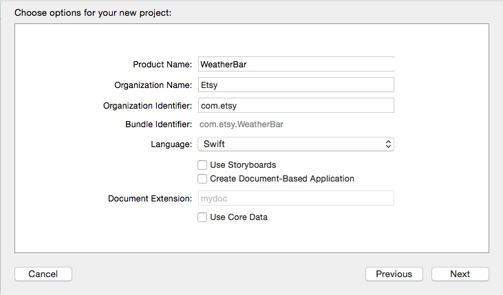
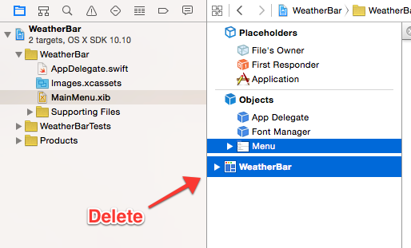
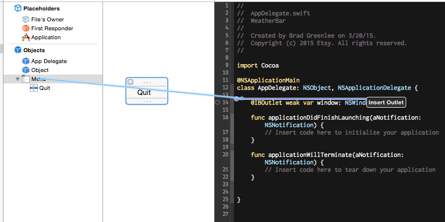
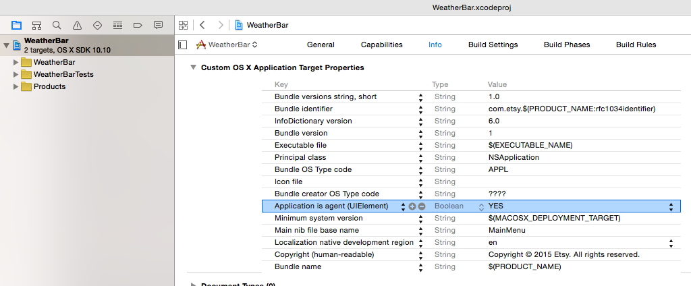
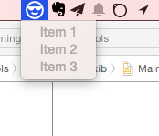
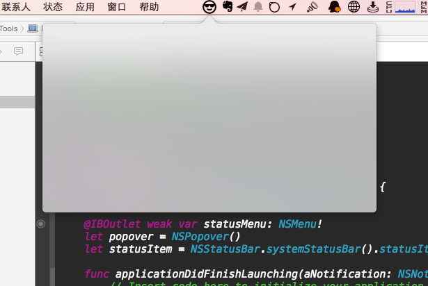
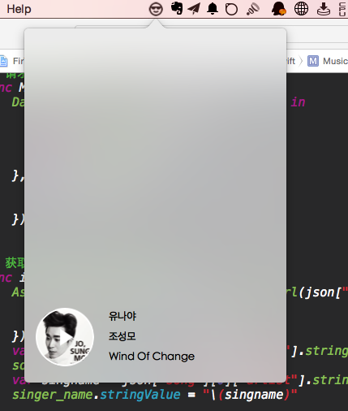

## OS X Menu Bar App 

Create a New Project or File ⟶ New ⟶ Project - Choose Application ⟶ Cocoa Application under  OS X and click Next 

点击 MainMenu.xib

删除默认的 window and menu 

	
打开 library 选择 menu 并且拖拽添加一个  NSMenu 

关联 NSMenu 到 AppDelegate.swift (删除原来的 var window)

	
	var statusMenu = NSMenu();
	
	**************
	
	let statusItem = NSStatusBar.systemStatusBar().statusItemWithLength(-1)
	
	// 显示名称
	
	statusItem.title = "Status Bar"
	statusItem.menu = statusMenu 
	
	
	//or  显示一个图标
	
	let icon = NSImage(named:"ic_cool")
	icon?.setTemplate(true) // 支持 Yosemite 的 Dark mode
	statusItem.image = icon 
	statusItem.menu = statusMenu 
	
	
	// or 显示一个 NSViewController
	
	先声明  let popover = NSPopover()
	
	 if let button = statusItem.button{
            button.image = NSImage(named: "ic_cool")
            button.action = Selector("togglePopover:")
        }
        
     popover.contentViewController = MasterViewController(nibName:"MasterViewController",bundle:nil)
     
     
      // 显示 popover
    func showPopover(sender: AnyObject?) {
        if let button = statusItem.button {
            popover.showRelativeToRect(button.bounds, ofView: button, preferredEdge: NSMinYEdge)
        }
    }
    
    // 关闭 popover
    func closePopover(sender: AnyObject?) {
        popover.performClose(sender)
    }
    
    // 显示 or 关闭 popover
    func togglePopover(sender: AnyObject?) {
        if popover.shown {
            closePopover(sender)
        } else {
            showPopover(sender)
        }
    }
    
    注意 EventMonitor.swift 当用户点击popover 窗口外的时候主动管理 popover
    

	
	

如图 添加  "Application is agent (UIElement)" 并且设置为 YES

然后运行 你将看到  效果如图

1 显示菜单

  

2 显示一个NSViewController 

## 7月29 号 

今天随便写了点 加入了 豆瓣FM 的歌曲播放功能  使用了 AFNetworking ，随便写了个 图片相关的工具类。

收工了，今天听下歌，趁老板不在！

	
